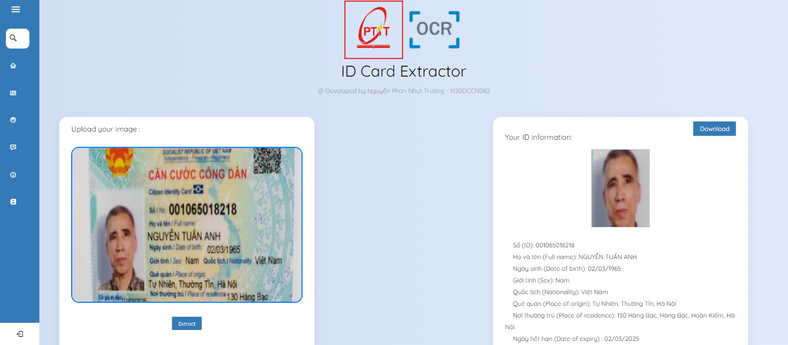

# **Vietnamese ID Card Extractor**

## **Introduction**

Đề tài: Xây dựng mô hình trích xuất thông tin CCCD (OCR)
SV: Nguyễn Phan Nhựt Trường N20DCCN082

## **Installation**
All requirement libraries are listed in requirements.txt. You can install it by using:

``` bash
# Virtual env recommended
pip install -r requirements.txt
```
or build through **[Docker](https://www.docker.com/)** by:

```
docker build -t <app_name> .
```

## **Usage**

``` python
python run.py
```
With Docker:
```
docker run -p 8080:8080 <app_name>
```

## **Demo**


## **TODO**
- [ ] Implement eKYC features.
- [ ] Improve speed of detection (Imma update newer version of YOLO).
- [ ] Improve accuracy of text recognized.
- [ ] Improve ability to align ID card in different light conditions.
- [ ] Code Refactoring

